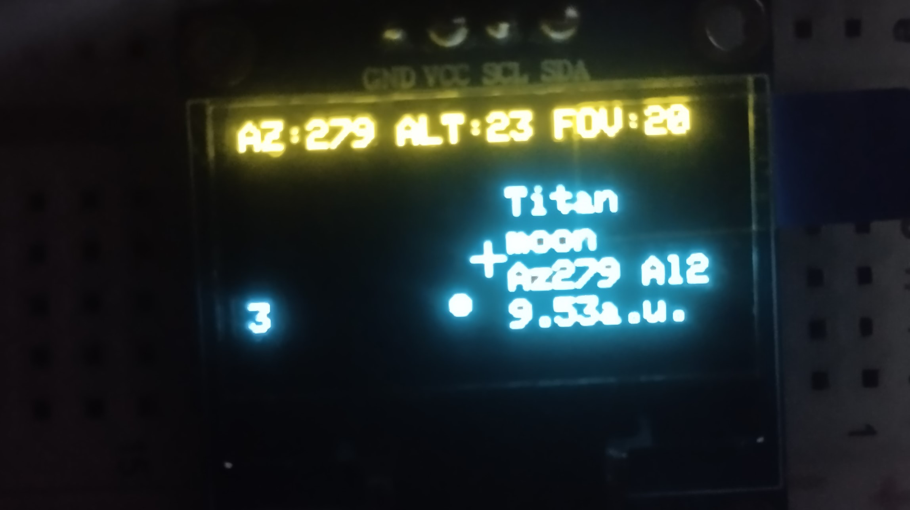

# AstroMap

Portable astronomy map and celestial object tracker for ESP32.


---

## Overview

AstroMap is a compact standalone astronomy device built around the ESP32 microcontroller and a 128×64 OLED display. It calculates the positions of major Solar System bodies in real time and visualizes them on a simplified sky map without requiring an internet connection.

Designed as both an educational and practical astronomy tool, AstroMap demonstrates orbital mechanics, celestial coordinate systems, and real-time astronomical calculations on resource-constrained embedded hardware.

---

## Preview

### Main Sky Map



---

## Features

### Real-Time Celestial Tracking

AstroMap calculates and displays the positions of:

* Sun
* Mercury
* Venus
* Mars
* Jupiter
* Saturn
* Uranus
* Neptune

### Natural Satellites

Supported moons include:

* Moon (Earth)
* Phobos
* Deimos
* Io
* Europa
* Ganymede
* Callisto
* Titan
* Titania
* Triton

### Interactive Sky Map

* Horizontal and vertical panning
* Adjustable field of view (FOV)
* Object selection
* Automatic target tracking
* Real-time coordinate updates

### Observer Configuration

Users can configure:

* Date and time
* Latitude
* Longitude

allowing the map to represent the sky from virtually any location on Earth.

### Fully Offline Operation

No Wi-Fi, GPS, or external services are required. All astronomical calculations are performed locally on the ESP32.

---

## How It Works

AstroMap uses orbital parameters and astronomical algorithms to determine the current positions of celestial bodies.

The software:

1. Calculates planetary positions in heliocentric coordinates.
2. Converts them into Earth-centered coordinates.
3. Computes local Altitude and Azimuth values.
4. Projects the results onto a 2D sky map displayed on the OLED screen.

This process runs continuously, creating a live representation of the visible Solar System.

---

## Hardware

### Core Components

* ESP32 Development Board
* SSD1306 OLED Display (128×64)
* 4×4 Matrix Keypad

### Display

* Resolution: 128×64 pixels
* Interface: I²C
* Controller: SSD1306

---

## Controls

The keypad allows navigation through menus and interaction with the sky map.

Available actions include:

* Menu navigation
* Time adjustment
* Coordinate editing
* Camera movement
* Zoom control
* Object selection
* Tracking mode

---

## Building the Project

### Clone the Repository

```bash
git clone https://github.com/Adstrum1/astromap.git
cd astromap
```

### Build

```bash
pio run
```

### Upload to ESP32

```bash
pio run --target upload
```

### Serial Monitor

```bash
pio device monitor
```

---

## Future Plans

Planned improvements include:

* GPS integration
* RTC module support
* Star catalog
* Constellation rendering
* Moon phase calculations
* Deep-sky object catalog
* Telescope integration
* Higher resolution displays

---

## Project Goals

The primary goals of AstroMap are:

* Learning embedded development
* Exploring astronomical algorithms
* Creating a portable astronomy companion
* Demonstrating real-time scientific visualization on microcontrollers
